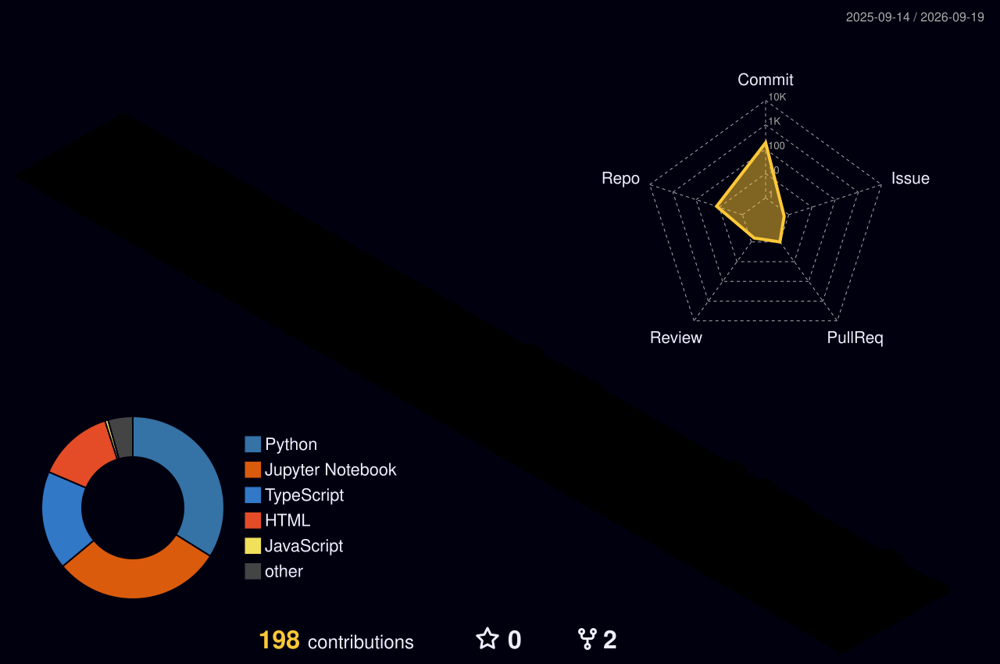



 

 

&nbsp;&nbsp;

&nbsp;&nbsp;

&nbsp;&nbsp;

---

 

## 💼 About Me

I'm a **Computer Science & Business Systems** undergraduate at **Heritage Institute of Technology, Kolkata**, engineering scalable, production-grade software at the intersection of **full-stack development**, **artificial intelligence**, and **machine learning**.

**Core Expertise**
- 🧩 **Full Stack Development** — end-to-end apps with modern, production-ready stacks
- 🧠 **Artificial Intelligence** — computer vision & LLM-powered systems, shipped to real users
- 📊 **Machine Learning** — predictive models and data-driven applications
- 🏗️ **System Design** — architecting scalable, maintainable systems
- ⚙️ **Software Engineering** — clean, efficient, well-documented code

> Learn by building. Break things intentionally. Understand why they broke. Ship something better.

---

 

## 🏆 Shipped Projects

<table>
  <tr>
    <td width="33%" valign="top">
      

        <h4 style="margin: 0 0 8px 0; color: #6E40C9; font-size: 16px;">🎯 SmartAttend</h4>
        
        

          AI-powered attendance management system — facial recognition, QR attendance, analytics, and separate teacher/student dashboards.
        

        

          
          
          
        

        
      

    </td>
    <td width="33%" valign="top">
      

        <h4 style="margin: 0 0 8px 0; color: #6E40C9; font-size: 16px;">🏋️ GymGuru</h4>
        
        

          Real-time AI fitness coach — live pose detection, posture correction, intelligent rep counting, and an AI voice coach.
        

        

          
          
          
        

        
      

    </td>
    <td width="33%" valign="top">
      

        <h4 style="margin: 0 0 8px 0; color: #6E40C9; font-size: 16px;">📄 ResuMatch</h4>
        
        

          ATS resume analyzer — scores resume-to-job-description compatibility using NLP, semantic similarity, and LLM-generated feedback.
        

        

          
          
          
        

        
      

    </td>
  </tr>
</table>

---

 

## 🔨 Currently Building

<table>
  <tr>
    <td width="50%" valign="top">
      

        <h4 style="margin: 0 0 8px 0; color: #6E40C9; font-size: 16px;">🎨 RoopAntar</h4>
        
        

          Real-time neural style transfer using Adaptive Instance Normalization (AdaIN) — fuses a content image's structure with a style image's texture in a single feed-forward pass, with continuous style-strength control.
        

        

          
          
          
        

        
      

    </td>
    <td width="50%" valign="top">
      

        <h4 style="margin: 0 0 8px 0; color: #6E40C9; font-size: 16px;">🤖 More AI/ML Projects</h4>
        
        

          A growing collection of applied ML experiments — predictive models, data pipelines, and interactive dashboards targeting real-world problems.
        

        

          
          
          
        

        
      

    </td>
  </tr>
</table>

---

 

## 🛠️ Tech Stack

### Languages

### Frontend

### Backend

### Databases

### AI / ML / Data Science

### Tools & Platforms

---

 

## 📊 GitHub Analytics & Insights

 

 

---

 

## 🧊 3D Contribution Graph

rotating 3D contribution calendar — regenerates daily via GitHub Actions

---

 

## 🐍 Contribution Snake

<picture>
  <source media="(prefers-color-scheme: dark)" srcset="https://raw.githubusercontent.com/ayushagarwal619/ayushagarwal619/output/github-contribution-grid-snake-dark.svg" />
  <source media="(prefers-color-scheme: light)" srcset="https://raw.githubusercontent.com/ayushagarwal619/ayushagarwal619/output/github-contribution-grid-snake.svg" />
  
</picture>

---

 

**Open to:** 🎓 Internships · 🤝 Technical Collaborations · 🚀 Open Source · 💻 Full Stack & AI/ML Projects

**Get in Touch:** [Email](mailto:ayushtechnoworld@gmail.com) · [LinkedIn](https://www.linkedin.com/in/ayush-kumar-agarwal-1970a8401/) · [GitHub](https://github.com/ayushagarwal619)

